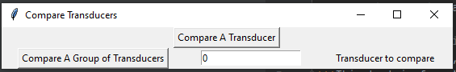

You should read this, it's **very important**.
You _might_ want to read this.
~~Never mind~~ - it wasn't _that_ important.

Let's try a few `combinations`:
**This text is strong, ~~this text is strong with strikethrough~~, and _this text is formatted with strong emphasis_**
***This text is formatted with strong emphasis too.***
___
# How to Run Transducer Comparison 

  
###***Only use the `Compare A Group of Transducers` button***

* `Input`: Number of transducer you want to do a comparison on.  
* Then `Click` the `Compare A Group of Transducers` 
* Choose the `voltsweep`, `freqsweep`, and `beamprofile` files for each set of measurements
    * select which setup was used to take the measurements (Coupler/325LA)
* repeat for each transducer
* Excel file should be generated afterwards in the project folder

***
Things that need to be done:
1. Fix plotting Output Graph
2. Clean up the page
   * get rid of obsolete code and commented out code
2. Push my changes
3. Create code review
   * Describe my changes
   * Assign reviewers
     * Ask for feedback